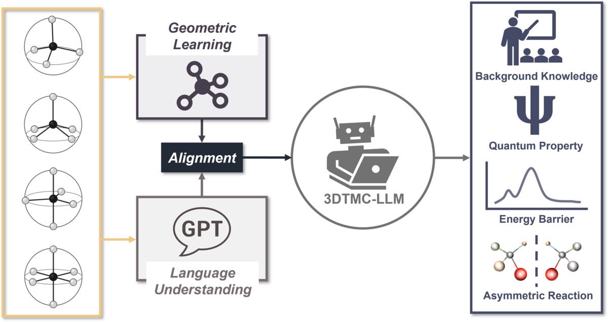

# 3DTMC-LLM

**3DTMC-LLM: Bridging 3D Geometry and Large Language Models for Transition Metal Complexes**



This repository implements a **3D encoder** fused with a **causal LLM** — by default **[Qwen/Qwen3-4B-Instruct-2507](https://huggingface.co/Qwen/Qwen3-4B-Instruct-2507)** — for generative tasks on transition metal complexes (TMCs). The stack is trained in stages: **3D encoder pretraining → Stage 1 (frozen LLM) → Stage 2 (LLM + LoRA + continued 3D alignment)**, then **downstream fine-tuning** on property prediction, barrier regression, and related tasks.

Training and inference share a **task registry** (`task_registry.py`) and **dataset helpers** (`task_datasets.py`). Downstream work uses the unified **`Stage3.py`** trainer and **`inference.py`** evaluator instead of separate per-task scripts.

### Environment

```bash
pip install -r requirements.txt
```

#### Uni-Core

Training and inference import **`unicore`** (e.g. `Dictionary` and the distributed framework). Install **Uni-Core** from source or wheels as documented in the upstream repo:

**[https://github.com/dptech-corp/Uni-Core](https://github.com/dptech-corp/Uni-Core)**

---

## Models and Datasets

Checkpoints and Stage 1 data for **3DTMC-LLM** are published on Hugging Face under **[Reecy/3DTMC-LLM](https://huggingface.co/Reecy/3DTMC-LLM)**.

| Asset | Location |
|------|----------|
| **Stage 2** (trained stack: LoRA adapter, tokenizer files, `3D_encoder.pt`, trainer state, etc.) | [Stage2](https://huggingface.co/Reecy/3DTMC-LLM/tree/main/Stage2) |
| **3D encoder (pretrained)** | [3D_encoder_pretrain](https://huggingface.co/Reecy/3DTMC-LLM/tree/main/3D_encoder_pretrain) |
| **Atom vocabulary for the 3D encoder** (`dict.txt` format) | [3D_encoder_dict.txt](https://huggingface.co/Reecy/3DTMC-LLM/blob/main/3D_encoder_dict.txt) (also shipped as `3D_encoder_dict.txt` in this repo) |
| **Stage 1 — TMC-Prop3D** (LMDB) | [TMC-Prop3D.lmdb](https://huggingface.co/Reecy/3DTMC-LLM/blob/main/TMC-Prop3D.lmdb) |
| **tmQMg — master table + random `Split`** | [tmQMg/all.csv](https://huggingface.co/Reecy/3DTMC-LLM/blob/main/tmQMg/all.csv) |

**Building datasets / text corpora**

- **`datasets_generation/enrich_description.py`** — starting from an LMDB with **`description`** and **`smiles`**, calls an OpenAI-compatible LLM and writes polished text to **`enriched_description`**. Use this workflow to build a **TMC-Prop3D-Enriched** dataset (enriched descriptions in LMDB) for Stage 2 training.
- **`datasets_generation/generate_QA_pairs.py`** — loads knowledge-source files (e.g. PDF, TXT, Markdown), splits into chunks, and uses the Chat Completions API to generate **Q&A pairs** saved for Stage 2 training.

**Closed-source LLM settings** (official vendor APIs; pinned snapshot IDs, access dates, and inference parameters for reproducibility).

| Model | Role | Vendor | API | Snapshot ID | Access date | Inference settings |
|-------|------|--------|-----|-------------|-------------|-------------------|
| GPT-4o | Data gen. — description polishing | OpenAI | [Chat Completions API](https://developers.openai.com/api/docs/models/gpt-4o) | `gpt-4o-2024-11-20` | 17 Jan 2026 | `temperature=0`, `top_p=1.0`; max output tokens: API default |
| GPT-4o | Data gen. — QA synthesis | OpenAI | [Chat Completions API](https://developers.openai.com/api/docs/models/gpt-4o) | `gpt-4o-2024-11-20` | 20 Jan 2026 | `temperature=0`, `top_p=1.0`; max output tokens: API default |
| GPT-5.2 | Baseline — Q&A/description generation | OpenAI | [Chat Completions API](https://developers.openai.com/api/docs/models/gpt-5.2) | `gpt-5.2-2025-12-11` | 29 Jan 2026 | (`reasoning.effort=none`); other inference parameters API default|
| GPT-5.5 | Evaluator — Q&A | OpenAI | [Chat Completions API](https://developers.openai.com/api/docs/models/gpt-5.5) | `gpt-5.5-2026-04-23` | 4 Jun 2026 | `medium` (`reasoning.effort`); other inference parameters API default |
| Claude Opus 4.7 | Evaluator — Q&A | Anthropic | [Messages API](https://platform.claude.com/docs/en/about-claude/models/overview) | `claude-opus-4-7` | 4 Jun 2026 | `medium` (`output_config.effort`); max output tokens: API default |
| Gemini 3.5 Flash | Evaluator — Q&A | Google | [generateContent API](https://ai.google.dev/gemini-api/docs/models/gemini-3.5-flash) | `gemini-3.5-flash` | 4 Jun 2026 | `medium` (`thinking_level`); other inference parameters API default |

---

## 1. 3D encoder

Downstream **Stage 1 / 2 / Stage 3** code expects **pretrained 3D encoder weights** and a **`dict.txt`** atom vocabulary.

### Option A — use our pretrained encoder

Load the encoder from **[Reecy/3DTMC-LLM/3D_encoder_pretrain](https://huggingface.co/Reecy/3DTMC-LLM/tree/main/3D_encoder_pretrain)** and use atom vocabulary **`3D_encoder_dict.txt`** (or the Hub copy linked above) as `dict.txt`.

### Option B — pretrain the 3D encoder yourself

1. **Data**  
   Use the **OMol25 from Meta**, e.g. **[`facebook/OMol25`](https://huggingface.co/datasets/facebook/OMol25)** or other TMC datasets, to build a large corpus of **TMC 3D structures**.  

2. **Vocabulary**  
   Obtain or build **`dict.txt`**.

3. **Training**  
   Run **`3D_encoder_trainer.py`**, using the **masked-atom, coordinate, and pairwise-distance** pretraining objective:

   ```bash
   # Example: adjust paths to your LMDB train/valid, dict.txt, and DeepSpeed JSON.
   deepspeed --num_gpus=N 3D_encoder_trainer.py \
     --dict /path/to/dict.txt \
     --train-path /path/to/train_lmdb_or_dir \
     --valid-path /path/to/valid.lmdb \
     --output-dir /path/to/encoder_pretrain_out \
     --deepspeed /path/to/deepspeed_config.json \
     --max-steps ... --save-steps ... --eval-steps ...
   ```

---

## 2. Stage 1

**Script:** `Stage1.py`  

- Trains the **3D encoder + single-token projection** into the LLM embedding space; **LLM is frozen**.  
- **Data:** tmQM-style **LMDB** with `atoms`, `coordinates`, `smiles`, `description`.  
- **Default mode:** instruction + SMILES + 3D → `description`.

**Ablation modes** (`--ablation`):

| `--ablation` | Prompt | Projection |
|--------------|--------|------------|
| `stage1` (default) | instruction + SMILES + 3D | single-token |
| `3d_only` | instruction + 3D only | single-token |
| `multi_token` | instruction + SMILES + 3D | learnable multi-token queries |

**Run (example):**

```bash
CUDA_VISIBLE_DEVICES=0,1 deepspeed --num_gpus=2 Stage1.py \
  --model_name Qwen/Qwen3-4B-Instruct-2507 \
  --train_lmdb /path/train.lmdb --val_lmdb /path/valid.lmdb \
  --3D_encoder_ckpt /path/to/encoder.pt \
  --3D_encoder_dict 3D_encoder_dict.txt \
  --output_dir /path/to/stage1_out
```

Defaults are centralized in **`train_defaults.py`** (`STAGE1_DEFAULTS`).

---

## 3. Stage 2

**Script:** `Stage2.py`  

- Continues from a **Stage 1 checkpoint**: **LoRA** on the LLM, **3D encoder + single-token projection** trainable.  
- **Default data:** (1) **LMDB** with `enriched_description`; (2) **JSON Q&A**.  

**Description ablations** (`--ablation`):

| `--ablation` | Data | Prompt / 3D recipe |
|--------------|------|---------------------|
| `stage2` (default) | enriched LMDB + JSON QA | instruction + SMILES + 3D |
| `freeze_3d` | enriched LMDB + JSON QA | frozen 3D encoder + projection |
| `random_3d` | enriched LMDB + JSON QA | random structure-slot embedding |
| `multi_token` | enriched LMDB | multi-token query projection |
| `3d_only` | enriched LMDB | 3D slot only (no SMILES) |

**Run (example):**

```bash
CUDA_VISIBLE_DEVICES=0,1 deepspeed --num_gpus=2 Stage2.py \
  --model_name Qwen/Qwen3-4B-Instruct-2507 \
  --Stage1_ckpt /path/to/stage1_checkpoint \
  --train_lmdb /path/train.lmdb --val_lmdb /path/valid.lmdb \
  --json_qa /path/to/qa.json \
  --output_dir /path/to/stage2_out
```

Pretrained **Stage 2** weights are provided under **[Reecy/3DTMC-LLM/Stage2](https://huggingface.co/Reecy/3DTMC-LLM/tree/main/Stage2)** (see **Models and Datasets** above).

Defaults: **`train_defaults.py`** (`STAGE2_DEFAULTS`, `DESCRIPTION_DEFAULTS`).

---

## 4. Stage 3 (Downstream tasks)

**Script:** `Stage3.py` — unified trainer for all Stage 3 regression tasks.

Initialize from a **Stage 2 checkpoint** (`Stage2_ckpt`: HF adapter + encoder weights + single-token projection weights).

| `--task` | Target | Split | Default data |
|----------|--------|-------|--------------|
| `dipole_moment` | dipole (Debye) | fixed train/val LMDB (see **tmQMg** below) | [tmQMg](https://github.com/hkneiding/tmqmg) |
| `polarisability` | polarisability (Bohr³) | fixed train/val LMDB | tmQMg |
| `homo_lumo_gap` | HOMO–LUMO gap (Ha) | fixed train/val LMDB | tmQMg |
| `vaska_barrier` | H₂ activation barrier (kcal/mol) | random 80/10/10 (`--split_seed`) | [vaskas-space](https://github.com/pascalfriederich/vaskas-space) — prebuilt LMDB: **[`vaskas-space/data.lmdb`](https://huggingface.co/Reecy/3DTMC-LLM/tree/main/vaskas-space)** |
| `nicomplex_ddg` | enantioselectivity ΔΔG (kcal/mol) | random 80/10/10 (`--split_seed`) | [Enantioselective-Cross-Coupling-Prediction](https://github.com/TheLiaoGroup/Enantioselective-Cross-Coupling-Prediction) |

**Training modes** (`--mode`; `--ablation` is a deprecated alias):

| `--mode` | Description |
|----------|-------------|
| `single_token` (default) | full SFT: instruction + SMILES + 3D |
| `freeze_3d` | frozen 3D encoder + projection; train LoRA only |
| `random_3d` | random structure-slot embedding; train LoRA only |
| `multi_token` | learnable multi-token query projection |
| `3d_only` | instruction + 3D only (no SMILES in prompt) |

**Run (examples):**

```bash
# TmQM property (default task: homo_lumo_gap)
CUDA_VISIBLE_DEVICES=0,1 deepspeed --num_gpus=2 Stage3.py \
  --task homo_lumo_gap \
  --Stage2_ckpt /path/to/stage2_checkpoint \
  --train_lmdb /path/train.lmdb --val_lmdb /path/valid.lmdb

# Vaska barrier with a fixed random split
CUDA_VISIBLE_DEVICES=0,1 deepspeed --num_gpus=2 Stage3.py \
  --task vaska_barrier \
  --lmdb /path/to/vaskas-space/data.lmdb \
  --split_seed 43

# NiComplex ΔΔG
CUDA_VISIBLE_DEVICES=0,1 deepspeed --num_gpus=2 Stage3.py \
  --task nicomplex_ddg \
  --lmdb /path/to/NiComplex/data.lmdb \
  --split_seed 42

# Property ablation: frozen 3D encoder
CUDA_VISIBLE_DEVICES=0,1 deepspeed --num_gpus=2 Stage3.py \
  --task dipole_moment --mode freeze_3d \
  --3D_encoder_ckpt /path/to/encoder.pt
```

**tmQMg data preparation**

1. **Download structures** — Fetch TMC **XYZ** coordinates from the upstream **[tmQMg](https://github.com/hkneiding/tmqmg)** release (see that repository for archives and file layout). Build LMDB shards with `atoms`, `coordinates`, `smiles`, and property fields (`dipole_moment`, `polarisability`, `homo_lumo_gap`). If SMILES are not bundled with the XYZ, derive them with **[xyz2mol_tm](https://github.com/jensengroup/xyz2mol_tm)** (Section 7).

2. **Random train / test split** — Use the published master table **[tmQMg/all.csv](https://huggingface.co/Reecy/3DTMC-LLM/blob/main/tmQMg/all.csv)** on Hugging Face. The **`Split`** column (`train` / `test`) defines the **random** holdout by `CSD code`. Subset your LMDB (or export ID lists) to match these folds for standard Stage 3 property training (`--train_lmdb` / `--val_lmdb`) and inference with `--fixed_lmdb_eval`.

3. **Similarity-controlled (OOD) split** — For cluster-based holdouts in fingerprint space (entire clusters held out as test), follow **[FAISS_split/README.md](FAISS_split/README.md)**: run `split_train_test_faiss.py` (default **K=150**, `far_from_train` strategy), then train with **`OOD/property/Property_OOD.py`** and evaluate with `inference.py stage3 --split_csv ...` (see **`OOD/README.md`**).

**NiComplex data preparation:** **`datasets_generation/build_ni_complex.py`** uses **MetalloGen** to assemble a five-coordinate square-pyramidal Ni complex from ligand/substrate XYZ fragments and writes **`complex_Ni.xyz`**. Requires Gaussian/xtb setup as in the script header.

```bash
python datasets_generation/build_ni_complex.py datasets_generation/NiComplex_example
```

**Backward compatibility:** `Stage3/Property.py`, `Stage3/NiComplex.py`, and `Stage3/Vaska_Complex.py` are thin wrappers that delegate to `Stage3.py`.

Hyperparameters and paths: **`train_defaults.py`** (`PROPERTY_DEFAULTS`, `NICOMPLEX_DEFAULTS`, `VASKA_DEFAULTS`).

---

## 5. Inference

**Script:** `inference.py` — unified evaluation for description ablations and Stage 3 regression (MAE / R²).

### Description generation (Stage 2 ablations)

```bash
python inference.py description \
  --mode stage2 \
  --ckpt /path/to/stage2_checkpoint \
  --test_lmdb /path/to/test.lmdb \
  --save_json description_preds.json
```

Supported `--mode` values: `stage2`, `freeze_3d`, `random_3d`, `3d_only`, `multi_token`.

### Stage 3 property / downstream evaluation

```bash
# TmQM property on a held-out LMDB (fixed train/val split)
python inference.py stage3 \
  --task dipole_moment \
  --fixed_lmdb_eval \
  --Stage3_ckpt /path/to/checkpoint \
  --test_lmdb /path/to/test.lmdb

# Vaska barrier (random 80/10/10 test fold)
python inference.py stage3 \
  --task vaska_barrier \
  --random_split \
  --Stage3_ckpt /path/to/checkpoint \
  --lmdb /path/to/vaskas-space/data.lmdb \
  --split_seed 43
```

### OOD evaluation

Out-of-distribution splits for property, Vaska ligand, and NiComplex scaffold holdouts are documented in **`OOD/README.md`**.

```bash
# Property OOD via user CSV split
python inference.py stage3 \
  --task dipole_moment \
  --Stage3_ckpt /path/to/checkpoint \
  --split_csv /path/to/split.csv \
  --split_name test \
  --save_json ood_preds.json

# Vaska: leave-one-ligand-out
python inference.py stage3 \
  --task vaska_barrier \
  --holdout_ligand dft-co \
  --lmdb /path/to/vaskas-space/data.lmdb \
  --Stage3_ckpt /path/to/ligand_dft-co \
  --save_json ood_preds.json

# NiComplex: scaffold holdout
python inference.py stage3 \
  --task nicomplex_ddg \
  --ood_experiment train_rest_test_Pybox \
  --lmdb /path/to/NiComplex/data.lmdb \
  --Stage3_ckpt /path/to/exp_train_rest_test_Pybox \
  --save_json ood_preds.json
```

OOD training entry points: **`OOD/property/Property_OOD.py`**, **`OOD/Vaska/Vaska_Ligand_OOD.py`**, **`OOD/NiComplex/NiComplex_OOD.py`**.

---

## 6. Interactive inference demo

**`inference_demo.py`** — single-structure **SMILES + XYZ + free-form instruction**. Example:

```bash
CUDA_VISIBLE_DEVICES=0 python inference_demo.py \
  --model_name Qwen/Qwen3-4B-Instruct-2507 \
  --Stage2_ckpt /path/to/checkpoint \
  --smiles "..." \
  --xyz /path/to/structure.xyz \
  --instruction "Your question here."
```

---

## 7. Building TMC structures and SMILES

| Goal | Resource |
|------|----------|
| **XYZ → SMILES** for TMCs | **[jensengroup/xyz2mol_tm](https://github.com/jensengroup/xyz2mol_tm)** |
| **Generate / assemble 3D TMC conformers** | **[kyunghoonlee777/MetalloGen](https://github.com/kyunghoonlee777/MetalloGen)** |

---

## 8. Repository layout (core)

| File / directory | Role |
|------------------|------|
| `3D_encoder_trainer.py` | 3D encoder LMDB pretraining with `Trainer` + DeepSpeed |
| `multimodal_LLM.py` | Geometry + Qwen stack; single-token / multi-token / ablation model recipes |
| `utils.py` | LMDB helpers, 3D batching, single-token embed fusion, collators |
| `task_registry.py` | Task definitions, instructions, split strategies (single source of truth) |
| `task_datasets.py` | Dataset classes and prompt assembly wired to the registry |
| `Stage1.py` / `Stage2.py` | Instruction-tuning stages (+ ablation modes) |
| `Stage3.py` | Unified Stage 3 trainer (`--task`, `--mode`) |
| `Stage3/Property.py`, `Stage3/NiComplex.py`, `Stage3/Vaska_Complex.py` | Backward-compatible wrappers around `Stage3.py` |
| `inference.py` | Unified batch inference and regression evaluation |
| `inference_demo.py` | Generic single-structure generation demo |
| `OOD/` | OOD split utilities and task-specific OOD training scripts |
| `FAISS_split/` | ComplexFingerprint + FAISS cluster train/test splits for tmQMg OOD |
| `OOD/property/` | Property OOD training, CSV cluster splits, and dataset helpers |
| `OOD/Vaska/`, `OOD/NiComplex/` | Vaska ligand and NiComplex scaffold OOD training |
| `train_defaults.py` | Default paths and hyperparameters |
| `3D_encoder_dict.txt` | Atom vocabulary for the 3D encoder |
| `datasets_generation/` | LMDB enrichment, Q&A generation, Ni complex builder |
| `requirements.txt` | Python dependencies (after PyTorch) |

---

## Citation

If you use **3DTMC-LLM**, please cite the **3DTMC-LLM** paper when available. 

---

## License

- **This repository** (code layout, training scripts, and assets **you** publish under **[Reecy/3DTMC-LLM](https://huggingface.co/Reecy/3DTMC-LLM)**): follow the **LICENSE** file in this repo and the terms on each Hugging Face model/data card you upload.
- **Third-party (not authored here):** **[Qwen3-4B-Instruct-2507](https://huggingface.co/Qwen/Qwen3-4B-Instruct-2507)** and **[OMol / OMol25](https://huggingface.co/datasets/facebook/OMol25)** (and related OMol resources) are separate products with **their own** licenses, attribution, and use restrictions—obey those sources, not this README alone.
- **Other** linked datasets, tools, and **baseline 3D encoder** code: each has its own license; check upstream repos and papers.
